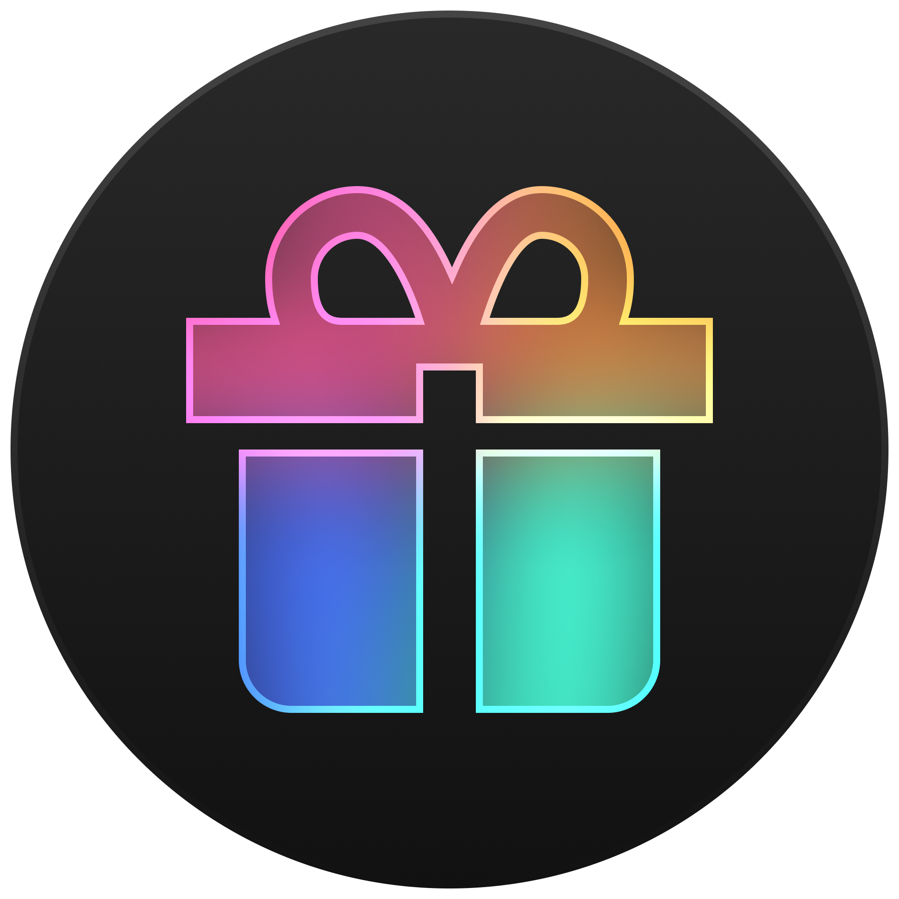

#  Steam Giveaway Tool

Steam Giveaway Tool is a cross-platform application with a graphical user interface (GUI) designed to easily distribute Steam store items among your friends.

Inspired by [DeadP47](https://t.me/deadp47gaymer/28300)

<a href="https://www.tinkoff.ru/rm/r_IyhoQQIETG.clGaATqxKK/1Qkhh56044">
  
</a>

# Demo

<div align="center">
  <video src="https://github.com/user-attachments/assets/22f9850c-7414-4f6c-b9ab-cbb9b32f48ec" type="video/mp4"></video>
</div>

## ⭐ Features

#### 🎉 **Giveaway & Randomization**
- Randomly select a specified number of friends for giveaways
- Track winners and their win count
- Filter friends based on 
  - **region**
  - **wishlist**
  - **past wins**
  - **owned apps**
  - **account age**
  - **playtime**
- <sub>Filtering by region, wishlist, playtime, and owned apps works only if this information is publicly available based on privacy settings</sub>

#### 🎁 **Gift Management**
- Copy friend nicknames and open Steam profiles directly from the app 
  - <sub>Currently automatic addition to the cart or gifting is not supported, but it may be added in the future</sub>

#### ⚙️ **Customization & UI Options**
- Hide avatars, app banners, and flag icons for a cleaner interface

#### 🛠 **Technical Features**
- Cross-platform compatibility
- Lightweight and portable
- Simple graphical interface

## 📥 Installation

### Pre-built Binaries

#### Windows

1. Download the latest release from the [Releases](https://github.com/INikonI/steam-giveaway-tool/releases)
2. Extract the ZIP file to a location of your choice
3. Run the `steam-giveaway-tool.exe` file to start the application

### Build from Source

#### Windows, macOS and Linux

To build the Steam Giveaway Tool from source, follow these steps:

1. Ensure you have Rust installed (version >= 1.85). If not, install it from [Rust's official website](https://www.rust-lang.org/tools/install) or using your package manager.

2. Clone the repository:
```bash
git clone https://github.com/INikonI/steam-giveaway-tool.git
cd steam-giveaway-tool
cargo build --release
```
After the build is complete, you can run the application by executing:
```bash
./target/release/steam-giveaway-tool
```

## 🚀 Usage

#### 🔑 Authorizing

To obtain a store token, follow these steps:

1. Log in to: https://store.steampowered.com/login
2. Open Steam Obtaining Token Page: https://store.steampowered.com/pointssummary/ajaxgetasyncconfig
3. Copy the value of `webapi_token`
4. Go to the app and paste token to `Menu > Settings > Access Token`

#### 🔄 How to Use the Giveaway Tool

1. **Launch the App**: Open the Steam Giveaway Tool from your desktop or terminal.

2. **Randomize Giveaway**:
- Choose the number of winners you want to select
- To track users who have already won, you can press `Save current`, and later in the filters, you can exclude these users
  - there is also an option for auto-saving, but if you perform test/randomizations by accident, it may count users as already winning, even if they haven't. Therefore, it’s better to use manual saving
- The app will randomly choose friends based on your filters and display them in the `Winners` list

3. **Your Friends**: 
- Click on the `Reload` button to reload a list of your Steam friends (if needed)
- To choose friends which only wishlist some app, you need:
  1. In `Store item for giveaway` category choose app
  2. In `Filters` category mark `Only has app in whishlist` option
- To choose friends which only have specific region, you need:
  1. In `Filters` category find `Region`, press `+`
  2. In pop-up choose any region you want with:
      - `include` option for shows only this region(s)
      - `exclude` option for excludes this region(s)
  3. And below in `include` and `exclude` fields you can remove any added region or press `Reset` button to display all regions

    <sub>`CIS` and `EU` is a set all corresponding regions</sub>

    <sub>`Unknown` if the user has not specified their region or has hidden it with privacy settings</sub>
- To choose friends who own a specific app and/or have a specific playtime:
  1. In the `Filters` category, find `Has store items` and press `+`
  2. Find and select the required app:
      - you can also specify all-time playtime in hours, for example, more than 10 hours
      - the same applies for 2-week playtime
- To choose friends who have an account age of more than some years:
  1. In the `Filters` category, find `Account age`
  2. Select the minimum number of years for an existing account to filter out new accounts, or left 0 to show all accounts

## Contributing

Contributions are welcome! Feel free to submit pull requests or report issues.

---
<sub>This project is not affiliated with, endorsed, or sponsored by Steam, Valve Corporation, or any of their subsidiaries. All trademarks, product names, and company names are the property of their respective owners</sub>
